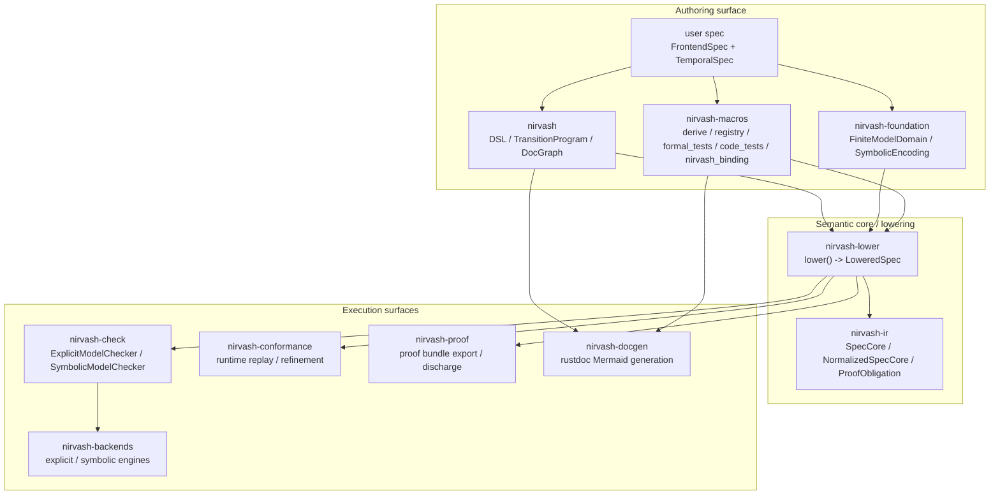
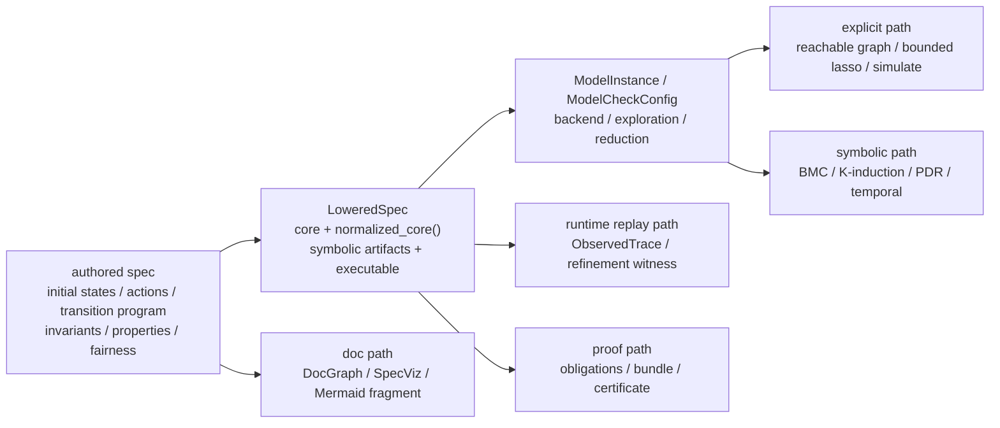

# nirvash

`nirvash` is the authoring facade of the standalone `nirvash` workspace.

If you would normally sketch a system in TLA+, `nirvash` gives you a Rust-first way to write
the same kind of state/action/invariant structure and lower it into one shared execution
boundary.

It is not a TLA+ parser or a full compatibility layer. The front door is:

```text
FrontendSpec + TemporalSpec -> LoweredSpec -> checker / conformance / proof / docgen
```

The DSL surface stays focused on `pred!`, `step!`, `ltl!`, `TransitionProgram`, and DocGraph
helpers, while lowering, checking, replay, proof export, and documentation live in sibling
crates.

The full end-to-end example for this flow lives in
[`examples/lock-manager-model`](../../examples/lock-manager-model).

## System Layout

The workspace is organized around three layers:

- Authoring surface
  - `nirvash`, `nirvash-foundation`, and `nirvash-macros`
- Semantic core and lowering
  - `nirvash-lower` and `nirvash-ir`
- Execution surfaces
  - `nirvash-check`, `nirvash-backends`, `nirvash-conformance`, `nirvash-proof`,
    and `nirvash-docgen`



`nirvash` is the front door for spec authors. `nirvash-lower` turns authored semantics into
`LoweredSpec`, and the remaining crates consume that lowered representation for checking,
runtime replay, proof export, and documentation.

## Shared Boundary

Every execution surface shares one canonical boundary:



- Canonical authoring contract
  - `FrontendSpec`, `TemporalSpec`, and `TransitionProgram`
- Canonical checker-facing contract
  - `nirvash_lower::LoweredSpec`
- Canonical symbolic and proof semantics
  - `LoweredSpec::normalized_core()`
- Canonical runtime refinement surface
  - `ObservedTrace`, `TraceRefinementMap`, and `step_refines_relation`
- Canonical documentation surface
  - `DocGraph` and `SpecViz` provider registration

## Crate Map

- `nirvash`
  - DSL, transition frontend, relational helpers, and shared doc graph types
- `nirvash-foundation`
  - `FiniteModelDomain`, `SymbolicEncoding`, and symbolic schema helpers
- `nirvash-macros`
  - derive macros, registry wiring, `formal_tests`, import-first `code_tests`,
    `nirvash_binding`, and subsystem registration
- `nirvash-ir`
  - backend-neutral `SpecCore`, `StateExpr`, `ActionExpr`, `TemporalExpr`,
    `FairnessDecl`, and proof obligations
- `nirvash-lower`
  - lowering boundary, `LoweredSpec`, and checker-facing config/model types
- `nirvash-check`
  - `ExplicitModelChecker` and `SymbolicModelChecker`
- `nirvash-backends`
  - explicit and symbolic engine implementations
- `nirvash-conformance`
  - runtime bindings, replay, generated harness plans, and adapters for `proptest`,
    `loom`, and `shuttle`
- `nirvash-proof`
  - proof bundle export and certificate-facing types
- `nirvash-docgen`
  - Mermaid/doc graph/spec-viz generation for rustdoc
- `cargo-nirvash`
  - CLI for `target/nirvash/{manifest,replay}` and generated replay files

## Backend Semantics

- `ModelBackend::Explicit + ExplorationMode::ReachableGraph`
  - Exact in-memory BFS reachable graph exploration
- `ModelBackend::Explicit + ExplorationMode::BoundedLasso`
  - Explicit bounded prefix and lasso enumeration
- `ModelBackend::Symbolic + ExplorationMode::ReachableGraph`
  - Direct SMT-based safety checking using `TransitionProgram`, `SpecCore`,
    and `SymbolicEncoding`
- `ModelBackend::Symbolic + ExplorationMode::BoundedLasso`
  - Direct SMT temporal checking with `BoundedLasso` or `LivenessToSafety`

The symbolic backend requires the AST-native DSL surface and fail-closes on unsupported
helpers, closure-based legacy paths, or unsupported normalized fragments. The explicit
backend supports symmetry canonicalization together with temporal properties and fairness.

`ModelCheckConfig` exposes common knobs plus backend-specific options:

- Shared options
  - `counterexample_minimization = None | ShortestTrace`
- Explicit options
  - `state_storage`, `compression`, `reachability`, `bounded_lasso`, `checkpoint`,
    `parallel`, `distributed`, and `simulation`
- Reduction controls
  - `with_claimed_reduction`, `with_certified_reduction`, and `with_heuristic_reduction`
- Symbolic options
  - `bridge`, `temporal`, `safety`, `k_induction`, and `pdr`

`nirvash-check` keeps `ExplicitModelChecker` and `SymbolicModelChecker` as the stable
checker front doors.

## Generated Code Tests

The generated code-test surface separates the spec item from the runtime binding:

- Spec side
  - Attach `#[code_tests]` to `struct Spec;`, `enum Spec`, or `type Spec = ...;`
  - Implement `FrontendSpec + TemporalSpec + SpecOracle`
- Runtime side
  - Attach `#[nirvash_binding(spec = Spec)]` to the binding `impl`
  - Use method-level attributes such as `#[nirvash(create)]`, `#[nirvash(action = ...)]`,
    `#[nirvash_fixture]`, `#[nirvash_project]`, `#[nirvash_project_output]`,
    and `#[nirvash_trace]`
- Canonical installer
  - `nirvash::import_generated_tests! { spec = Spec, binding = Binding }`
- Generated modules
  - `generated::{prelude, metadata, seeds, profiles, plans, install, replay, bindings}`
  - `generated::install::{all_tests!, tests!, unit_tests!, trace_tests!, loom_tests!}`

Artifacts are written under `target/nirvash/{manifest,replay}`. Materialized replay files are
written under `tests/generated/*_replay.rs`, and `tests/generated.rs` is refreshed so Cargo can
run them as an integration test crate.

## Minimal Example

```rust
use nirvash::{BoolExpr, TransitionProgram};
use nirvash_conformance::SpecOracle;
use nirvash_lower::{FrontendSpec, TemporalSpec};
use nirvash_macros::{
    FiniteModelDomain as FormalFiniteModelDomain,
    code_tests, nirvash_binding, nirvash_expr, nirvash_project, nirvash_project_output,
    nirvash_transition_program,
};

#[derive(Clone, Copy, Debug, PartialEq, Eq, serde::Serialize, serde::Deserialize, FormalFiniteModelDomain)]
enum Client {
    Alice,
    Bob,
}

#[derive(Clone, Copy, Debug, PartialEq, Eq, serde::Serialize, serde::Deserialize, FormalFiniteModelDomain)]
enum Phase {
    Idle,
    Waiting,
    Holding,
}

#[derive(Clone, Copy, Debug, PartialEq, Eq, serde::Serialize, serde::Deserialize, FormalFiniteModelDomain)]
struct State {
    alice: Phase,
    bob: Phase,
}

#[derive(Clone, Copy, Debug, PartialEq, Eq, serde::Serialize, serde::Deserialize, FormalFiniteModelDomain)]
enum Action {
    Request(Client),
    Grant(Client),
    Release(Client),
}

#[derive(Clone, Debug, PartialEq, Eq, serde::Serialize, serde::Deserialize)]
enum Output {
    Applied,
    Blocked,
}

#[derive(Default)]
#[code_tests]
struct LockManagerSpec;

impl FrontendSpec for LockManagerSpec {
    type State = State;
    type Action = Action;

    fn frontend_name(&self) -> &'static str {
        "lock_manager"
    }

    fn initial_states(&self) -> Vec<Self::State> {
        vec![State {
            alice: Phase::Idle,
            bob: Phase::Idle,
        }]
    }

    fn actions(&self) -> Vec<Self::Action> {
        vec![
            Action::Request(Client::Alice),
            Action::Grant(Client::Alice),
            Action::Release(Client::Alice),
            Action::Request(Client::Bob),
            Action::Grant(Client::Bob),
            Action::Release(Client::Bob),
        ]
    }

    fn transition_program(&self) -> Option<TransitionProgram<Self::State, Self::Action>> {
        Some(nirvash_transition_program! {
            rule request_alice
                when matches!(action, Action::Request(Client::Alice))
                    && matches!(prev.alice, Phase::Idle) => {
                set alice <= Phase::Waiting;
            }

            rule grant_alice
                when matches!(action, Action::Grant(Client::Alice))
                    && matches!(prev.alice, Phase::Waiting)
                    && !matches!(prev.bob, Phase::Holding) => {
                set alice <= Phase::Holding;
            }

            rule release_alice
                when matches!(action, Action::Release(Client::Alice))
                    && matches!(prev.alice, Phase::Holding) => {
                set alice <= Phase::Idle;
            }

            rule request_bob
                when matches!(action, Action::Request(Client::Bob))
                    && matches!(prev.bob, Phase::Idle) => {
                set bob <= Phase::Waiting;
            }

            rule grant_bob
                when matches!(action, Action::Grant(Client::Bob))
                    && matches!(prev.bob, Phase::Waiting)
                    && !matches!(prev.alice, Phase::Holding) => {
                set bob <= Phase::Holding;
            }

            rule release_bob
                when matches!(action, Action::Release(Client::Bob))
                    && matches!(prev.bob, Phase::Holding) => {
                set bob <= Phase::Idle;
            }
        })
    }
}

impl TemporalSpec for LockManagerSpec {
    fn invariants(&self) -> Vec<BoolExpr<Self::State>> {
        vec![nirvash_expr!(mutual_exclusion(state) =>
            !(matches!(state.alice, Phase::Holding) && matches!(state.bob, Phase::Holding))
        )]
    }
}

impl SpecOracle for LockManagerSpec {
    type ExpectedOutput = Output;

    fn expected_output(
        &self,
        _prev: &Self::State,
        _action: &Self::Action,
        next: Option<&Self::State>,
    ) -> Self::ExpectedOutput {
        if next.is_some() {
            Output::Applied
        } else {
            Output::Blocked
        }
    }
}

#[derive(Default, serde::Serialize, serde::Deserialize)]
struct MockLockManager {
    state: State,
}

#[nirvash_binding(spec = LockManagerSpec)]
impl MockLockManager {
    #[nirvash(action = Action::Request)]
    fn request(&mut self, client: Client) -> Output {
        /* apply request(client) */
        # let _ = client;
        # Output::Applied
    }

    #[nirvash(action = Action::Grant)]
    fn grant(&mut self, client: Client) -> Output {
        /* apply grant(client) */
        # let _ = client;
        # Output::Applied
    }

    #[nirvash(action = Action::Release)]
    fn release(&mut self, client: Client) -> Output {
        /* apply release(client) */
        # let _ = client;
        # Output::Applied
    }

    #[nirvash_project]
    fn project(&self) -> State {
        self.state
    }

    #[nirvash_project_output]
    fn project_output(_action: &Action, output: &Output) -> Output {
        output.clone()
    }
}

nirvash::import_generated_tests! {
    spec = LockManagerSpec,
    binding = MockLockManager,
}
```

See [`examples/lock-manager-model`](../../examples/lock-manager-model) for the complete
executable example, including reachable-graph exploration and runtime tests.
