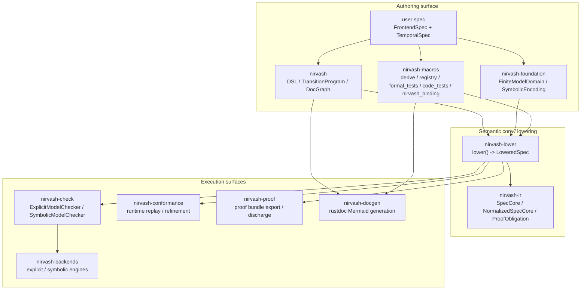
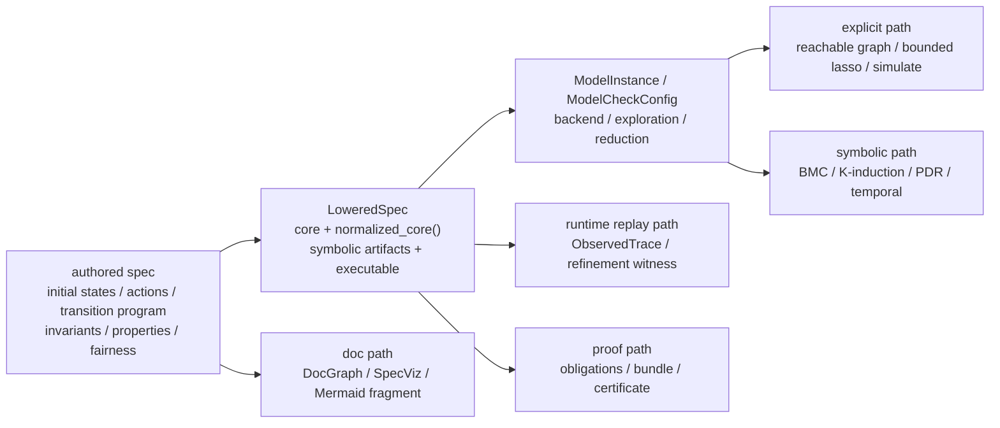

# nirvash

`nirvash` is the authoring facade of the standalone `nirvash` workspace.

It keeps the Rust-first DSL surface focused on `pred!`, `step!`, `ltl!`, `TransitionProgram`,
and DocGraph helpers, while the lowering, checking, replay, proof-export, and documentation
surfaces live in sibling crates.

## System Layout

The workspace is organized around three layers:

- Authoring surface
  - `nirvash`, `nirvash-foundation`, and `nirvash-macros`
- Semantic core and lowering
  - `nirvash-lower` and `nirvash-ir`
- Execution surfaces
  - `nirvash-check`, `nirvash-backends`, `nirvash-conformance`, `nirvash-proof`,
    and `nirvash-docgen`



`nirvash` is the front door for spec authors. `nirvash-lower` turns authored semantics into
`LoweredSpec`, and the remaining crates consume that lowered representation for checking,
runtime replay, proof export, and documentation.

## Shared Boundary

Every execution surface shares one canonical boundary:



- Canonical authoring contract
  - `FrontendSpec`, `TemporalSpec`, and `TransitionProgram`
- Canonical checker-facing contract
  - `nirvash_lower::LoweredSpec`
- Canonical symbolic and proof semantics
  - `LoweredSpec::normalized_core()`
- Canonical runtime refinement surface
  - `ObservedTrace`, `TraceRefinementMap`, and `step_refines_relation`
- Canonical documentation surface
  - `DocGraph` and `SpecViz` provider registration

## Crate Map

- `nirvash`
  - DSL, transition frontend, relational helpers, and shared doc graph types
- `nirvash-foundation`
  - `FiniteModelDomain`, `SymbolicEncoding`, and symbolic schema helpers
- `nirvash-macros`
  - derive macros, registry wiring, `formal_tests`, import-first `code_tests`,
    `nirvash_binding`, and subsystem registration
- `nirvash-ir`
  - backend-neutral `SpecCore`, `StateExpr`, `ActionExpr`, `TemporalExpr`,
    `FairnessDecl`, and proof obligations
- `nirvash-lower`
  - lowering boundary, `LoweredSpec`, and checker-facing config/model types
- `nirvash-check`
  - `ExplicitModelChecker` and `SymbolicModelChecker`
- `nirvash-backends`
  - explicit and symbolic engine implementations
- `nirvash-conformance`
  - runtime bindings, replay, generated harness plans, and adapters for `proptest`,
    `loom`, `shuttle`, and materialized `kani` workflows
- `nirvash-proof`
  - proof bundle export and certificate-facing types
- `nirvash-docgen`
  - Mermaid/doc graph/spec-viz generation for rustdoc
- `cargo-nirvash`
  - CLI for `target/nirvash/{manifest,replay}` and generated replay or `kani` files

## Backend Semantics

- `ModelBackend::Explicit + ExplorationMode::ReachableGraph`
  - Exact in-memory BFS reachable graph exploration
- `ModelBackend::Explicit + ExplorationMode::BoundedLasso`
  - Explicit bounded prefix and lasso enumeration
- `ModelBackend::Symbolic + ExplorationMode::ReachableGraph`
  - Direct SMT-based safety checking using `TransitionProgram`, `SpecCore`,
    and `SymbolicEncoding`
- `ModelBackend::Symbolic + ExplorationMode::BoundedLasso`
  - Direct SMT temporal checking with `BoundedLasso` or `LivenessToSafety`

The symbolic backend requires the AST-native DSL surface and fail-closes on unsupported
helpers, closure-based legacy paths, or unsupported normalized fragments. The explicit
backend supports symmetry canonicalization together with temporal properties and fairness.

`ModelCheckConfig` exposes common knobs plus backend-specific options:

- Shared options
  - `counterexample_minimization = None | ShortestTrace`
- Explicit options
  - `state_storage`, `compression`, `reachability`, `bounded_lasso`, `checkpoint`,
    `parallel`, `distributed`, and `simulation`
- Reduction controls
  - `with_claimed_reduction`, `with_certified_reduction`, and `with_heuristic_reduction`
- Symbolic options
  - `bridge`, `temporal`, `safety`, `k_induction`, and `pdr`

`nirvash-check` keeps `ExplicitModelChecker` and `SymbolicModelChecker` as the stable
checker front doors.

## Generated Code Tests

The generated code-test surface separates the spec item from the runtime binding:

- Spec side
  - Attach `#[code_tests]` to `struct Spec;`, `enum Spec`, or `type Spec = ...;`
  - Implement `FrontendSpec + TemporalSpec + SpecOracle`
- Runtime side
  - Attach `#[nirvash_binding(spec = Spec)]` to the binding `impl`
  - Use method-level attributes such as `#[nirvash(create)]`, `#[nirvash(action = ...)]`,
    `#[nirvash_fixture]`, `#[nirvash_project]`, `#[nirvash_project_output]`,
    and `#[nirvash_trace]`
- Canonical installer
  - `nirvash::import_generated_tests! { spec = Spec, binding = Binding }`
- Generated modules
  - `generated::{prelude, metadata, seeds, profiles, plans, install, replay, bindings}`
  - `generated::install::{all_tests!, tests!, unit_tests!, trace_tests!, kani_harnesses!, loom_tests!}`

Artifacts are written under `target/nirvash/{manifest,replay}`. Materialized replay and
`kani` files are written under `tests/generated/*_{replay,kani}.rs`.

## Minimal Example

```rust
use nirvash::TransitionProgram;
use nirvash_check as checks;
use nirvash_lower::{FrontendSpec, TemporalSpec};
use nirvash_macros::{
    FiniteModelDomain as FormalFiniteModelDomain,
    SymbolicEncoding as FormalSymbolicEncoding,
    nirvash_expr, nirvash_transition_program,
};

#[derive(Clone, Copy, Debug, PartialEq, Eq, FormalFiniteModelDomain, FormalSymbolicEncoding)]
enum State {
    Idle,
    Busy,
}

#[derive(Clone, Copy, Debug, PartialEq, Eq, FormalFiniteModelDomain, FormalSymbolicEncoding)]
enum Action {
    Start,
    Finish,
}

#[derive(Default)]
struct Spec;

impl FrontendSpec for Spec {
    type State = State;
    type Action = Action;

    fn frontend_name(&self) -> &'static str {
        "Spec"
    }

    fn initial_states(&self) -> Vec<Self::State> {
        vec![State::Idle]
    }

    fn actions(&self) -> Vec<Self::Action> {
        vec![Action::Start, Action::Finish]
    }

    fn transition_program(&self) -> Option<TransitionProgram<Self::State, Self::Action>> {
        Some(nirvash_transition_program! {
            rule start when matches!(action, Action::Start) && matches!(prev, State::Idle) => {
                set self <= State::Busy;
            }

            rule finish when matches!(action, Action::Finish) && matches!(prev, State::Busy) => {
                set self <= State::Idle;
            }
        })
    }
}

impl TemporalSpec for Spec {
    fn invariants(&self) -> Vec<nirvash::BoolExpr<Self::State>> {
        vec![nirvash_expr!(declared_states_are_valid(state) => matches!(state, State::Idle | State::Busy))]
    }
}

let spec = Spec::default();
let mut lowering_cx = nirvash_lower::LoweringCx;
let lowered = spec.lower(&mut lowering_cx).expect("spec lowers");
let result = checks::ExplicitModelChecker::new(&lowered)
    .check_all()
    .expect("checker runs");
assert!(result.is_ok());
```
